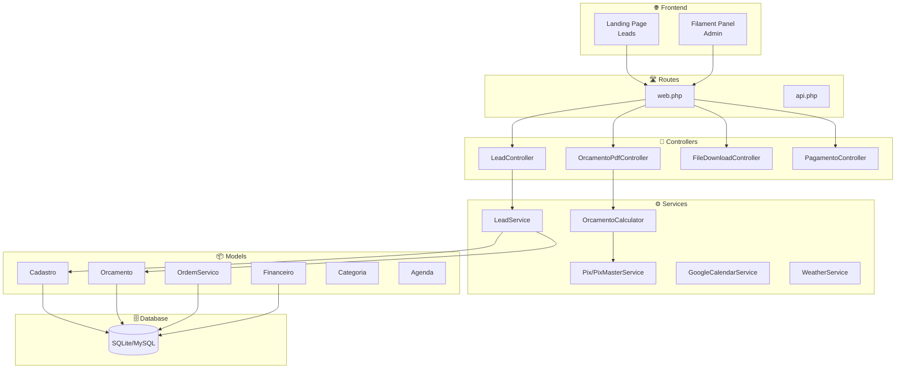
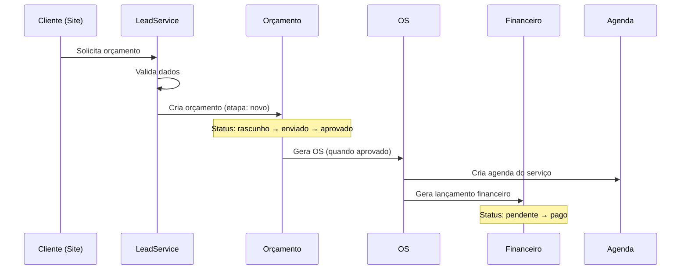
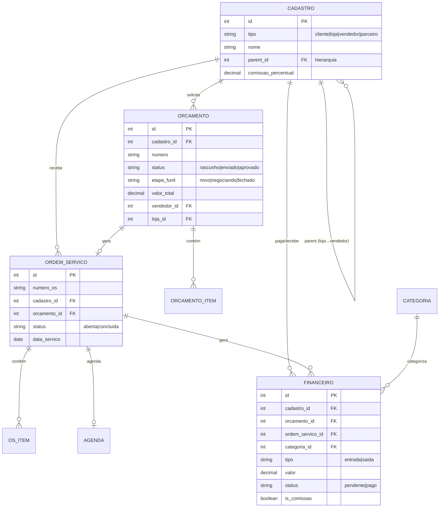

# 🏗️ Arquitetura do Sistema STOFGARD

Este documento descreve a arquitetura técnica do sistema de gestão STOFGARD.

## 📊 Visão Geral da Arquitetura



## 🔄 Fluxo Principal de Negócio



## 📁 Estrutura de Diretórios Relevantes

```
app/
├── Console/Commands/        # Comandos Artisan customizados
├── Filament/
│   └── Resources/           # CRUD Filament (Financeiro, Orcamento, OS)
├── Http/Controllers/        # Controllers tradicionais (PDF, Webhooks)
├── Models/                  # Eloquent Models
├── Services/                # Lógica de negócio isolada
│   ├── LeadService.php      # Captação de leads
│   ├── OrcamentoCalculator.php  # Matemática financeira
│   └── Pix/                 # Integração PIX EFI/Gerencianet
├── Policies/                # Autorização
└── Traits/                  # Traits reutilizáveis

config/
├── backup.php               # Configuração Spatie Backup
├── browsershot.php          # Geração de PDFs
└── services.php             # Chaves de APIs externas

database/
├── migrations/              # Estrutura do banco
└── seeders/                 # Dados iniciais

docs/                        # Documentação
routes/
├── web.php                  # Rotas web (limpo, sem lógica)
└── api.php                  # API (webhooks PIX)
```

## 🔗 Relacionamentos dos Models Principais



## 🔧 Comandos Artisan Customizados

### `php artisan iron:check`
Verifica a integridade do ambiente:
- Conexão com banco de dados
- Configurações de PIX
- Chaves de API (Google, Weather)
- Permissões de diretórios

### `php artisan backup:run`
Executa backup completo:
- Banco de dados
- Arquivos de storage
- Envio para disco externo (se configurado)

### `php artisan queue:work`
Processa filas em background:
- Envio de emails
- Geração de PDFs
- Sincronização Google Calendar

## 🔐 Variáveis de Ambiente Importantes

```env
# ===========================================
# BANCO DE DADOS
# ===========================================
DB_CONNECTION=sqlite          # ou mysql em produção
DB_DATABASE=/path/to/database.sqlite

# ===========================================
# INTEGRAÇÃO PIX (EFI/Gerencianet)
# ===========================================
EFI_CLIENT_ID=seu_client_id
EFI_CLIENT_SECRET=seu_client_secret
EFI_SANDBOX=true              # false em produção
EFI_PIX_KEY=sua_chave_pix
EFI_CERTIFICATE_PATH=/path/to/certificado.pem

# ===========================================
# GOOGLE CALENDAR
# ===========================================
GOOGLE_CLIENT_ID=xxx.apps.googleusercontent.com
GOOGLE_CLIENT_SECRET=GOCSPX-xxx
GOOGLE_REDIRECT_URI=https://seudominio.com/google/callback
GOOGLE_CALENDAR_ID=primary

# ===========================================
# CLIMA (OpenWeatherMap)
# ===========================================
WEATHER_API_KEY=sua_api_key
WEATHER_CITY_ID=3451190       # Ribeirão Preto
WEATHER_UNITS=metric

# ===========================================
# PDF GERAÇÃO (Browsershot)
# ===========================================
CHROME_PATH=/usr/bin/chromium
NODE_PATH=/usr/bin/node
NPM_PATH=/usr/bin/npm

# ===========================================
# BACKUP
# ===========================================
BACKUP_DISK=google            # ou s3
BACKUP_NOTIFICATION_MAIL=admin@empresa.com
```

## 🚀 Serviços Principais

### LeadService
Responsável pela captação de leads do site público:
- Validação robusta de dados
- Busca/criação de cliente
- Criação de orçamento inicial no funil

### OrcamentoCalculator
Centraliza toda matemática financeira:
- Cálculo de subtotais
- Aplicação de descontos (prestador, PIX)
- Cálculo de comissões (vendedor, loja)
- Geração de dados PIX para PDF

### PixMasterService
Integração com EFI/Gerencianet:
- Geração de QR Code PIX
- Verificação de pagamentos
- Webhook para confirmação automática

### GoogleCalendarService
Sincronização com agenda Google:
- Criação de eventos
- Atualização automática
- OAuth2 refresh token

## 📱 Responsividade Mobile

Os Resources Filament seguem a regra:
- **Mobile (< md)**: 2-3 colunas essenciais (Nome, Valor, Status)
- **Tablet (md)**: + Cliente, Tipo
- **Desktop (lg+)**: Todas as colunas

Colunas configuradas com:
```php
->visibleFrom('md')  // Oculta no mobile
->hiddenFrom('md')   // Visível apenas no mobile
```

## 🔒 Segurança

### FileDownloadController
- Whitelist de extensões (.pdf, .jpg, .png, etc.)
- Verificação de Path Traversal
- Validação de disco permitido
- Limite de tamanho (100MB)
- Logging de tentativas suspeitas

### Rotas Assinadas
```php
Route::get('/orcamento/{orcamento}/publico', ...)
    ->middleware('signed');
```

### Autenticação
- Filament com middleware `auth`
- Proteção CSRF padrão Laravel
- Rate limiting em rotas públicas

---

**Última atualização:** Fevereiro 2026
