# 📖 Manual do Software — Autonomia Ilimitada

> **Versão:** 1.0 — Março/2026  
> **Plataforma:** SaaS Multi-Tenant (Laravel + Filament)  
> **Público-alvo:** Dono do sistema (Super Admin) e Clientes Finais (Tenants)

---

## 📑 Índice Geral

1. [Visão Geral do Sistema](#1-visão-geral-do-sistema)
2. [Arquitetura e Planos](#2-arquitetura-e-planos)
3. [Acesso e Login](#3-acesso-e-login)
4. [Dashboard — Painel Principal](#4-dashboard--painel-principal)
5. [Cadastros (CRM Unificado)](#5-cadastros-crm-unificado)
6. [Orçamentos](#6-orçamentos)
7. [Funil de Vendas (CRM Kanban)](#7-funil-de-vendas-crm-kanban)
8. [Ordens de Serviço (OS)](#8-ordens-de-serviço-os)
9. [Financeiro](#9-financeiro)
10. [Agenda e Calendário](#10-agenda-e-calendário)
11. [Estoque e Almoxarifado](#11-estoque-e-almoxarifado)
12. [Garantias](#12-garantias)
13. [Notas Fiscais](#13-notas-fiscais)
14. [Tabela de Preços](#14-tabela-de-preços)
15. [Categorias e Produtos](#15-categorias-e-produtos)
16. [Tarefas](#16-tarefas)
17. [Equipamentos](#17-equipamentos)
18. [Lista de Desejos](#18-lista-de-desejos)
19. [Formulários Dinâmicos](#19-formulários-dinâmicos)
20. [Gerenciamento de Equipe](#20-gerenciamento-de-equipe)
21. [Relatórios e Análises](#21-relatórios-e-análises)
22. [Busca Universal](#22-busca-universal)
23. [PDFs Inteligentes](#23-pdfs-inteligentes)
24. [Integração PIX](#24-integração-pix)
25. [WhatsApp e Mensagens](#25-whatsapp-e-mensagens)
26. [Portal do Cliente Final](#26-portal-do-cliente-final)
27. [Vitrine Pública (Link na Bio)](#27-vitrine-pública-link-na-bio)
28. [Agendamento Público (Clone Calendly)](#28-agendamento-público-clone-calendly)
29. [Captação de Leads](#29-captação-de-leads)
30. [Integração Google Calendar](#30-integração-google-calendar)
31. [GPS Check-in](#31-gps-check-in)
32. [Central de Comando (Configurações)](#32-central-de-comando-configurações)
33. [Dados e Backup](#33-dados-e-backup)
34. [Painel Super Admin](#34-painel-super-admin)
35. [LGPD e Segurança](#35-lgpd-e-segurança)
36. [Tickets de Suporte](#36-tickets-de-suporte)
37. [Glossário](#37-glossário)

---

## 1. Visão Geral do Sistema

O **Autonomia Ilimitada** é um sistema SaaS completo de gestão empresarial voltado para prestadores de serviços (higienização, impermeabilização, manutenção, etc.). Ele cobre todo o ciclo de vida do serviço: do lead à garantia.

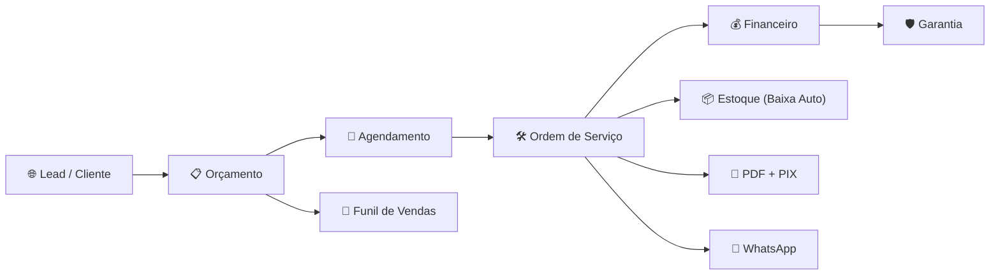

### Principais Características

| Recurso | Descrição |
|---------|-----------|
| **Multi-Tenant** | Cada empresa (tenant) tem banco de dados isolado |
| **3 Planos** | Start, Pro, Elite — com recursos progressivos |
| **LGPD Compliance** | Dados sensíveis criptografados (AES-256 + HMAC) |
| **Auditoria Completa** | Todas ações rastreadas com audit trail |
| **PDF Dinâmico** | Layout configurável via drag-and-drop |
| **PIX Integrado** | QR Code gerado automaticamente |
| **Portal do Cliente** | Acesso via Magic Link (sem senha) |

---

## 2. Arquitetura e Planos

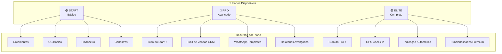

| Plano | Limite OS/mês | Usuários | Recursos Premium |
|-------|--------------|----------|-----------------|
| **Start** | Configurável | Configurável | Módulos básicos |
| **Pro** | Ampliado | Ampliado | CRM, WhatsApp, Relatórios |
| **Elite** | Ilimitado | Ilimitado | GPS, Indicações, Tudo |

---

## 3. Acesso e Login

### Para o administrador da empresa (Tenant)

1. Acesse: `sistema.seudominio.com.br/admin/login`
2. Insira **e-mail** e **senha**
3. Selecione o **tenant** (empresa) se houver mais de um

### Para o cliente final

O cliente **não precisa de senha**. Ele recebe um **Magic Link** por WhatsApp:
1. O prestador envia o link via sistema
2. O cliente clica → acessa o **Portal do Cliente**
3. O token é temporário e seguro

---

## 4. Dashboard — Painel Principal

O Dashboard é a tela inicial após login. Ele é **totalmente configurável**.

### Elementos do Dashboard

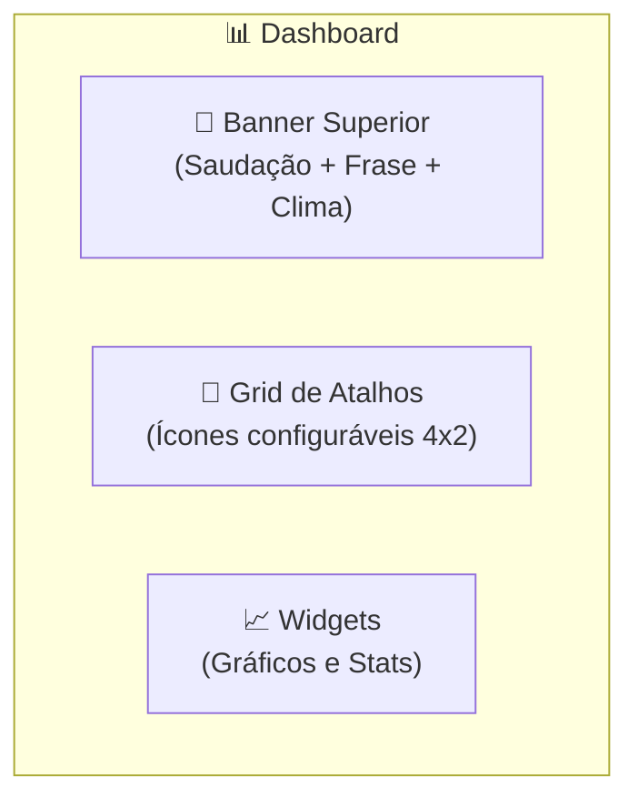

| Componente | Descrição | Configurável? |
|------------|-----------|:-------------:|
| **Banner Superior** | Gradiente com saudação, frase motivacional e widget de clima | ✅ Cores, textos, cidade |
| **Grid de Atalhos** | Ícones de acesso rápido (OS, Orçamentos, Agenda, etc.) | ✅ Colunas, espaçamento |
| **Widget de Clima** | Previsão do tempo da cidade configurada | ✅ Cidade, visibilidade |
| **Gráfico Financeiro** | Receitas vs Despesas mensal | Automático |
| **Stats do Financeiro** | Resumo: Saldo, Receitas, Despesas | Automático |
| **Gráfico Fluxo de Caixa** | Fluxo mensal | Automático |
| **Widget Oracle** | Insights inteligentes | Automático |
| **Calendário** | Próximos eventos da agenda | Automático |

### Como personalizar o Dashboard

1. Vá em **⚙️ Configurações** → aba **Dashboard**
2. Configure:
   - **Frase de boas-vindas** (coluna esquerda)
   - **Frase motivacional** (centro)
   - **Cores do gradiente** (início e fim)
   - Widget de clima: **cidade** e **visibilidade**
   - **Colunas** desktop e mobile
   - **Espaçamento** entre ícones

---

## 5. Cadastros (CRM Unificado)

O sistema usa um **cadastro unificado** para todos os tipos de contato.

### Tipos de cadastro

| Tipo | Ícone | Uso |
|------|-------|-----|
| **Cliente** | 👤 | Pessoas que contratam serviços |
| **Loja** | 🏬 | Lojas parceiras que indicam clientes |
| **Vendedor** | 🧑‍💼 | Vendedores vinculados a lojas |
| **Arquiteto** | 🏗️ | Arquitetos parceiros |
| **Funcionário** | 👷 | Colaboradores da empresa |

### Campos disponíveis

- **Dados pessoais:** Nome, CPF/CNPJ, RG/IE, E-mail
- **Telefones:** Celular, Telefone fixo (sincronizados automaticamente)
- **Endereço:** CEP (com busca automática), Logradouro, Número, Bairro, Cidade, Estado, Complemento
- **Comercial:** Comissão (%), Loja vinculada (para vendedores)
- **Funcionário:** Cargo, Salário base, Data admissão/demissão, É sócio?, Percentual pró-labore

### Funcionalidades

- ✅ Busca global por nome, cidade, bairro
- ✅ Busca por CPF/telefone/e-mail via **hash criptográfico** (LGPD)
- ✅ Geração de **ficha cadastral em PDF**
- ✅ Histórico de orçamentos, OS e financeiro de cada cadastro
- ✅ Dados sensíveis criptografados com **AES-256**
- ✅ Soft delete (cadastros podem ser recuperados)

### Como criar um cadastro

1. Menu lateral → **Cadastros** → **+ Novo Cadastro**
2. Selecione o **tipo** (Cliente, Loja, Vendedor, etc.)
3. Preencha os campos obrigatórios (Nome, Telefone)
4. O CEP preenche endereço automaticamente
5. Clique em **Salvar**

---

## 6. Orçamentos

O módulo de orçamentos é um dos mais completos do sistema.

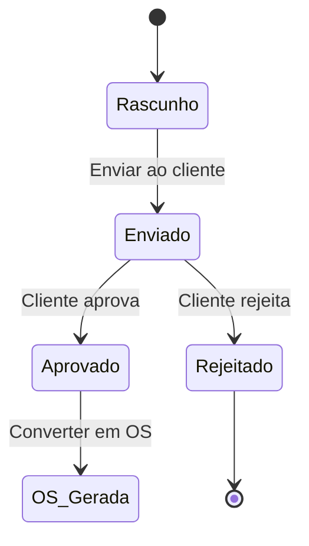

### Características

| Recurso | Descrição |
|---------|-----------|
| **Numeração automática** | Formato: `ANO.SEQUENCIAL` (ex: 2026.0015) |
| **Multi-opção (A/B/C)** | O cliente pode escolher entre até 3 opções |
| **Itens detalhados** | Tipo de serviço, quantidade, valor unitário |
| **Comissões** | Comissão para vendedor e loja (automático) |
| **Desconto prestador** | Diferença entre valor total e valor editado |
| **PDF customizável** | Com ou sem PIX, fotos, comissões, parcelamento |
| **Fotos do serviço** | Galeria com upload de fotos antes/depois |
| **QR Code PIX** | Gerado automaticamente no PDF |
| **Envio via WhatsApp** | Link direto para enviar ao cliente |

### Como criar um orçamento

1. Menu → **Orçamentos** → **+ Novo Orçamento**
2. Selecione o **Cliente** (ou crie um novo)
3. Adicione **itens** com tipo de serviço e valores
4. Configure opções de PDF (PIX, fotos, desconto)
5. Salve e envie ao cliente

### Multi-opção (A/B/C)

O sistema permite criar até **3 opções** diferentes no mesmo orçamento:
- **Opção A:** Higienização básica
- **Opção B:** Higienização + Impermeabilização
- **Opção C:** Combo completo

O cliente escolhe qual opção aprovar diretamente pelo **Portal do Cliente**.

---

## 7. Funil de Vendas (CRM Kanban)

> ⚠️ **Disponível:** Planos Pro e Elite

O Funil de Vendas é um **quadro Kanban** visual para gerenciar o ciclo de vendas.

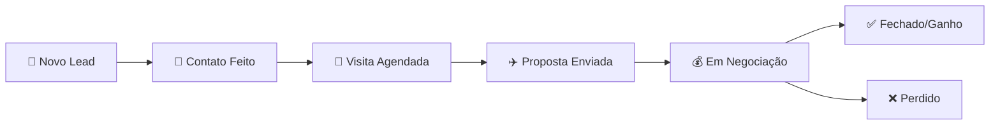

### Colunas do Funil

| Etapa | Descrição |
|-------|-----------|
| 🌟 **Novo Lead** | Lead recém-captado |
| 💬 **Contato Feito** | Primeiro contato realizado |
| 📅 **Visita Agendada** | Visita marcada |
| ✈️ **Proposta Enviada** | Orçamento enviado |
| 💰 **Em Negociação** | Em discussão de valores |
| ✅ **Fechado / Ganho** | Serviço aprovado |
| ❌ **Perdido** | Lead não converteu |

### Funcionalidades

- **Arrastar e soltar** cards entre colunas
- **Criar novo lead** direto do funil (formulário rápido)
- **Filtros:** por vendedor, período (hoje, semana, mês)
- **Estatísticas em tempo real** por etapa (quantidade + valor total)
- **Alerta de leads parados** (sem movimentação há 7+ dias)

### Como usar o Funil

1. Dashboard → atalho **Funil de Vendas** ou Menu → **Funil de Vendas**
2. Clique em **+ Novo Lead** para criar um lead rapidamente
3. Arraste os cards entre as colunas conforme o progresso
4. Use **Leads Parados** para identificar oportunidades frias
5. Use **Estatísticas** para ter uma visão macro

---

## 8. Ordens de Serviço (OS)

A Ordem de Serviço documenta todo o trabalho realizado.

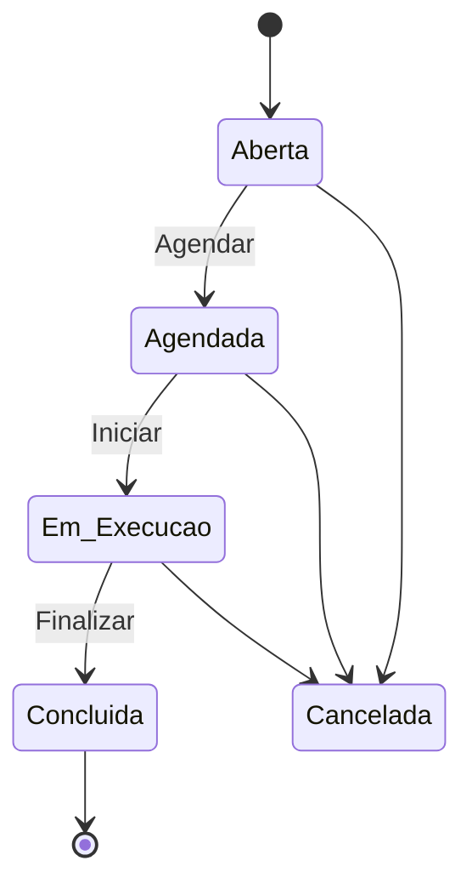

### Campos da OS

| Campo | Descrição |
|-------|-----------|
| **Número OS** | Gerado automaticamente: `ANO.SEQUENCIAL` |
| **Cliente** | Vinculado ao cadastro |
| **Tipo de serviço** | Higienização, Impermeabilização, Combo, Outro |
| **Descrição** | Detalhes do serviço |
| **Datas** | Abertura, Prevista, Conclusão |
| **Valores** | Total, Desconto |
| **Garantia** | Dias de garantia configurável |
| **Fotos** | Antes e depois (com otimização automática) |
| **Estoque** | Produtos utilizados (baixa automática ao concluir) |
| **Funcionário** | Responsável pela execução |
| **Loja/Vendedor** | Parceiros vinculados |
| **Formulário dinâmico** | Checklist customizável |
| **GPS Check-in** | Registro de localização (Elite) |

### Automações ao concluir a OS

1. ✅ **Baixa automática de estoque** dos produtos vinculados
2. ✅ **Geração de garantia** com período configurado por tipo de serviço
3. ✅ **Notificação WhatsApp** ao cliente (PRO+)
4. ✅ **Indicação automática** via WhatsApp após 24h (Elite)

### Como criar uma OS

1. Menu → **Ordens de Serviço** → **+ Nova OS**
2. Selecione o **Cliente**
3. Defina **tipo de serviço** e **descrição**
4. Adicione **itens** (serviços e produtos)
5. Tire **fotos** (antes do serviço)
6. Salve e acompanhe o status

### Conversão de Orçamento em OS

Ao aprovar um orçamento, o sistema pode **converter automaticamente** em uma OS:
- Os dados do cliente são herdados
- Os itens são transferidos
- O financeiro é vinculado

---

## 9. Financeiro

O módulo financeiro controla todas as entradas (receitas) e saídas (despesas).

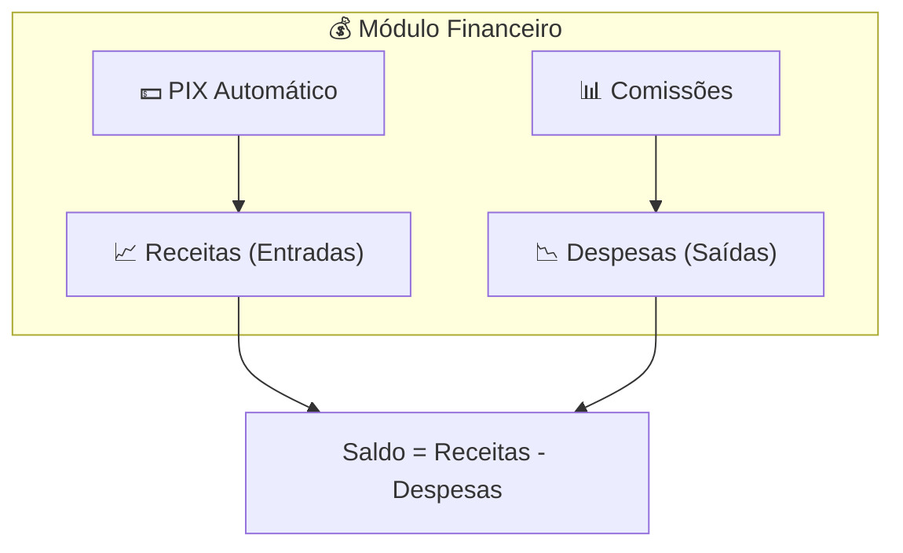

### Recursos

| Recurso | Descrição |
|---------|-----------|
| **Receitas/Despesas** | Cadastro manual ou automático |
| **Categorias** | Organização por categorias personalizáveis |
| **Status** | Pendente, Pago, Vencido, Cancelado |
| **Formas de pagamento** | PIX, Dinheiro, Cartão (débito/crédito), Boleto, Transferência |
| **Vinculação** | Orçamento, OS, Cadastro |
| **Comissões** | Controle de comissão de vendedor/loja |
| **PIX integrado** | QR Code + Copia e Cola gerado automaticamente |
| **Parcelamento** | Taxas de cartão configuráveis |

### Automações

- Ao aprovar um orçamento → **receita é criada automaticamente**
- Ao concluir uma OS → **receita é atualizada/criada**
- PIX pago → **status atualizado via webhook**
- Vencimento passado → **alerta de vencido**

### Relatórios Financeiros

- **Extrato mensal** em PDF
- **Gráfico de receitas vs despesas**
- **Despesas por categoria** (gráfico de pizza)
- **Fluxo de caixa** (linha temporal)
- **Vendas por tipo de serviço**
- **Pró-labore** (cálculo automático para sócios)

---

## 10. Agenda e Calendário

### Tipos de evento

| Tipo | Descrição |
|------|-----------|
| **Serviço** | Execução de serviço agendada |
| **Visita** | Visita técnica ou comercial |
| **Reunião** | Reunião interna ou com cliente |
| **Entrega** | Entrega de material/equipamento |
| **Lembrete** | Lembrete genérico |

### Funcionalidades

- ✅ **Visualização em calendário** (mês, semana, dia)
- ✅ **Drag & drop** para alterar datas
- ✅ **Vinculação** com OS, Orçamento e Cliente
- ✅ **Endereço com link Google Maps** automático
- ✅ **Lembretes** configuráveis (minutos antes)
- ✅ **Integração Google Calendar** (sincronização bidirecional)
- ✅ **Geração de PDF** da agenda
- ✅ **Status:** Agendado, Em andamento, Concluído, Cancelado

### Como agendar

1. Menu → **Agenda** → **+ Novo Evento**
2. Preencha título, data/hora, local
3. Vincule a um **cliente** ou **OS** (opcional)
4. Configure lembrete (ex: 30 min antes)
5. Salve

---

## 11. Estoque e Almoxarifado

O módulo de estoque controla materiais e produtos utilizados nos serviços.

### Recursos

| Recurso | Descrição |
|---------|-----------|
| **Cadastro de itens** | Nome, quantidade, unidade, tipo |
| **Preço interno** | Custo de aquisição |
| **Preço venda** | Valor cobrado do cliente |
| **Mínimo de alerta** | Estoque mínimo (alerta visual) |
| **Local de estoque** | Múltiplos locais (galpão, veículo, etc.) |
| **Baixa automática** | Ao concluir OS, desconta os produtos usados |
| **Estorno** | Possibilidade de estornar a quantidade |

### Indicadores visuais

- 🟢 **Verde:** Estoque OK (acima de 3x o mínimo)
- 🟡 **Amarelo:** Estoque baixo (entre 1x e 3x o mínimo)
- 🔴 **Vermelho:** Estoque crítico (abaixo do mínimo)

### Como vincular estoque a uma OS

1. Na criação/edição da OS, seção **Produtos Utilizados**
2. Selecione o **produto do estoque**
3. Informe a **quantidade utilizada**
4. Ao **concluir a OS**, a baixa é feita automaticamente

---

## 12. Garantias

O sistema gerencia garantias automaticamente com base no tipo de serviço.

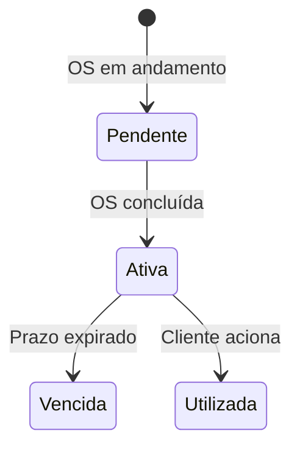

### Como funciona

1. Cada **tipo de serviço** tem um prazo de garantia configurável (em dias)
2. Quando a OS é **concluída**, a garantia é **criada automaticamente**
3. O sistema aplica `data_início = data_conclusão_OS` e calcula `data_fim`
4. Status: **Ativa**, **Vencida**, **Utilizada**
5. O PDF de garantia pode ser gerado e enviado ao cliente

### Visibilidade

- **Dias restantes** exibidos na listagem
- **Próximas a vencer** (alerta em 30 dias)
- **Motivo de uso** registrado quando a garantia é acionada
- Geração de **PDF de garantia** com validade legal

---

## 13. Notas Fiscais

### Campos

| Campo | Descrição |
|-------|-----------|
| **Número NF** | Número da nota fiscal |
| **Série** | Série da nota |
| **Tipo** | NFe, NFSe, etc. |
| **Modelo** | Modelo fiscal |
| **Chave de acesso** | Código da nota fiscal |
| **Valores** | Total, Produtos, Serviços, ICMS, ISS, PIS, COFINS |
| **Status** | Emitida, Cancelada |
| **XML/PDF** | Caminhos dos arquivos da nota |

### Funcionalidades

- Vinculação com **cliente** e **OS**
- Geração de **PDF da nota fiscal**
- Controle de **cancelamento** (data e motivo)
- Cálculos de impostos (ICMS, ISS, PIS, COFINS)

---

## 14. Tabela de Preços

A tabela de preços unificada centraliza todos os itens e serviços com seus valores.

### Recursos

- **Nome do item/serviço**
- **Preço base**
- **Categorização** por tipo de serviço
- **Descrição** para PDF
- **Dias de garantia** por item
- Usado como referência ao criar orçamentos e OS

### Acesso

1. **Configurações** → aba **Serviços e Itens** → link **Tabela de Preços Unificada**
2. Ou diretamente no menu lateral (se habilitado)

---

## 15. Categorias e Produtos

### Categorias

As categorias organizam itens financeiros e de serviço:
- Usadas no **módulo financeiro** para classificar receitas e despesas
- Gráficos de **despesas por categoria**
- Geração de PDF por categoria

### Produtos

- Cadastro de produtos para venda direta
- Controle de **estoque atual**
- **Preço de venda**
- Vinculação ao almoxarifado

---

## 16. Tarefas

Módulo de gestão de tarefas internas:

- **Título** e **descrição**
- **Status:** Pendente, Em andamento, Concluída
- **Atribuição** a funcionários
- **Prazo** de conclusão
- Geração de **PDF da tarefa**

---

## 17. Equipamentos

Cadastro e controle de equipamentos da empresa:

- **Nome** e **descrição** do equipamento
- **Estado de conservação**
- **Manutenção** programada
- Geração de **PDF do equipamento**

---

## 18. Lista de Desejos

Módulo para registrar produtos/serviços desejados ou planejados:

- **Nome do item**
- **Prioridade**
- **Valor estimado**
- **Observações**
- Geração de **PDF da lista**

---

## 19. Formulários Dinâmicos

> Recurso avançado para checklists personalizáveis por tipo de serviço.

### Funcionalidades

- Criação de **formulários customizados**
- **Vinculação à OS** — o formulário aparece durante a execução
- **Respostas registradas** no banco de dados
- Campos dinâmicos configuráveis

### Exemplo de uso

Um formulário de "Checklist de Higienização" pode incluir:
- ☑️ Aspirou o estofado?
- ☑️ Aplicou produto desinfetante?
- ☑️ Realizou teste de secagem?

---

## 20. Gerenciamento de Equipe

Módulo para gerenciar collaboradores:

- **Cadastro de funcionários** com dados trabalhistas
- **Cargos**
- **Salário base**
- **Datas** de admissão e demissão
- Identificação de **sócios** com percentual de pró-labore

---

## 21. Relatórios e Análises

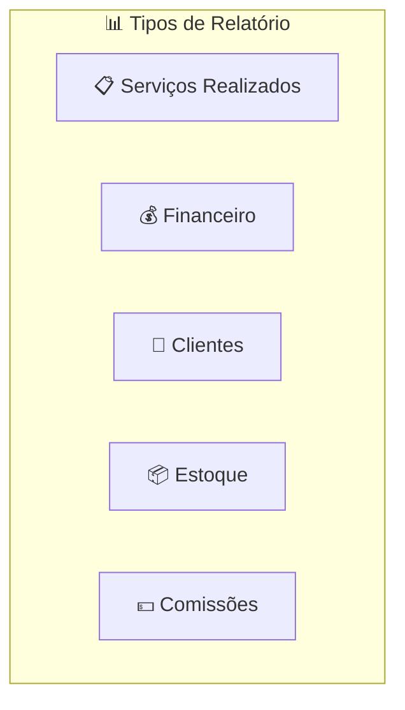

### Filtros disponíveis

| Filtro | Opções |
|--------|--------|
| **Período** | Hoje, Esta Semana, Este Mês, Mês Anterior, Últimos 30/90 dias, Ano, Personalizado |
| **Cadastro** | Filtrar por cliente ou parceiro específico |
| **Tipo** | Serviços, Financeiro, Clientes, Estoque, Comissões |

### Relatório de Serviços

- Total de serviços no período
- Concluídos, Em andamento, Cancelados
- Valor total e **ticket médio**
- Lista dos 10 últimos serviços

### Relatório Financeiro

- Receitas (total, pagas, pendentes)
- Despesas (total, pagas, pendentes)
- **Saldo líquido**
- Últimas 15 transações

### Relatório de Clientes

- Total de clientes e parceiros
- Novos no período
- Com e sem serviços (**ativos vs inativos**)
- **Top 10** por volume de serviços

---

## 22. Busca Universal

A **Busca Universal** pesquisa simultaneamente em **todos os módulos** do sistema.

### Módulos pesquisáveis

| Módulo | Campos de busca |
|--------|----------------|
| **Cadastros** | Nome, endereço, cidade, CPF (via hash), telefone (via hash), e-mail (via hash) |
| **Orçamentos** | Número, descrição, nome do cliente |
| **Ordens de Serviço** | Número OS, descrição, nome do cliente |
| **Financeiro** | Descrição, observações |
| **Agenda** | Título, descrição, local |
| **Produtos** | Nome, descrição |

### Filtros da busca

- **Módulo:** Todos, Cadastros, Orçamentos, OS, Financeiro, Agenda, Produtos
- **Status:** Pendente, Aprovado, Concluído, Cancelado, Pago, Aberta, Agendado
- **Ordenação:** Mais recente, Mais antigo, Nome A-Z, Maior/Menor valor
- **Período:** Data início e data fim

---

## 23. PDFs Inteligentes

O sistema gera PDFs profissionais para **todos** os módulos.

### PDFs disponíveis

| Módulo | Rota |
|--------|------|
| Orçamento | `/orcamento/{id}/pdf` |
| Ordem de Serviço | `/os/{id}/pdf` |
| Agenda | `/agenda/{id}/pdf` |
| Cadastro (Ficha) | `/cadastro/{id}/pdf` |
| Financeiro | `/financeiro/{id}/pdf` |
| Relatório Mensal | `/financeiro/relatorio/mensal` |
| Extrato | `/extrato/pdf` |
| Nota Fiscal | `/nota-fiscal/{id}/pdf` |
| Categoria | `/categoria/{id}/pdf` |
| Produto | `/produto/{id}/pdf` |
| Tarefa | `/tarefa/{id}/pdf` |
| Equipamento | `/equipamento/{id}/pdf` |
| Garantia | `/garantia/{id}/pdf` |
| Tabela de Preço | `/tabelapreco/{id}/pdf` |
| Lista de Desejos | `/listadesejo/{id}/pdf` |
| Estoque | `/estoque/{id}/pdf` |

### Construtor de Layout PDF (Drag & Drop)

O layout do PDF é **totalmente configurável** via a aba **Personalização de PDF** nas Configurações:

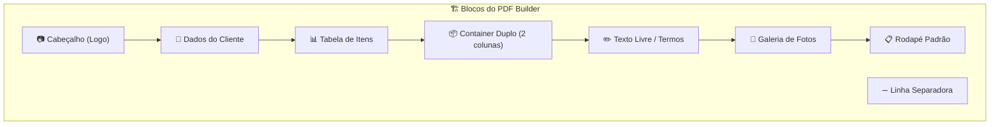

| Bloco | Configuração |
|-------|-------------|
| **Cabeçalho** | Mostrar logo, datas, alinhamento (esq/centro/dir) |
| **Dados do Cliente** | Mostrar/ocultar email, telefone, endereço |
| **Tabela de Itens** | Título, cores por categoria |
| **Container Duplo** | Coluna esq/dir: Totais, QR PIX, Garantia, Vazio |
| **Texto Livre** | Editor rico (negrito, itálico, listas) |
| **Linha Separadora** | Cor e espessura |
| **Galeria de Fotos** | Colunas (1-4), legendas |
| **Rodapé** | Texto legal |

### Cores do PDF

- **Cor primária, Secundária e do Texto** configuráveis
- Toggle: Habilitar fotos, QR PIX, Desconto à vista

---

## 24. Integração PIX

O sistema possui integração nativa com PIX (via EFI/Gerencianet).

### Fluxo de cobrança PIX

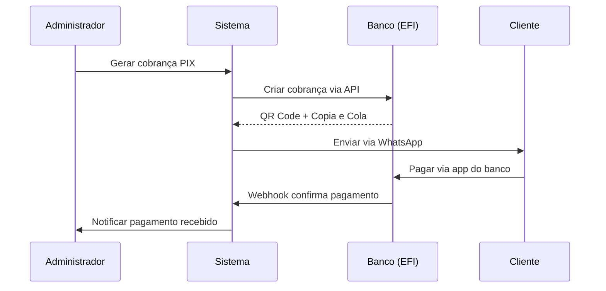

### Chaves PIX configuráveis

Tipos aceitos: CPF, CNPJ, Telefone, E-mail, Aleatória (EVP)

**Configuração:** ⚙️ Configurações → aba **Financeiro** → **Chaves PIX**

Cada chave inclui:
- Tipo da chave
- Valor (validação automática por tipo)
- Titular (máx. 25 caracteres — limitação PIX)
- Status de validação

### Desconto à vista (PIX/Dinheiro)

- Percentual configurável nas **Configurações** → **Financeiro** → **Desconto à Vista**
- Aplicado automaticamente nos PDFs
- Pode ser ativado/desativado por orçamento individual

---

## 25. WhatsApp e Mensagens

> ⚠️ **Disponível:** Planos Pro e Elite

### Templates configuráveis

| Template | Variáveis disponíveis |
|----------|----------------------|
| **Cobrança PIX** | `{nome}`, `{documento}`, `{valor}`, `{link}`, `{pix_copia_cola}` |
| **OS Concluída** | `{nome}`, `{numero_os}`, `{tipo_servico}` |

### Configuração

1. ⚙️ **Configurações** → aba **WhatsApp / Mensagens**
2. Edite os templates com as variáveis desejadas
3. Deixe vazio para usar o padrão do sistema

### Mensagens automáticas

- Ao gerar **cobrança PIX** → mensagem de cobrança
- Ao **concluir OS** → notificação ao cliente
- **Indicação automática** (Elite) → enviada 24h após conclusão da OS

---

## 26. Portal do Cliente Final

O Portal do Cliente permite que o cliente acompanhe seus serviços **sem precisar de senha**.

### Acesso via Magic Link

1. O prestador gera um **link mágico** no sistema
2. Envia via WhatsApp
3. O cliente clica e acessa o portal
4. O token é temporário e seguro

### O que o cliente pode ver

| Recurso | Descrição |
|---------|-----------|
| **Orçamentos** | Visualizar orçamentos recebidos |
| **Aprovar opção** | Escolher opção A, B ou C do orçamento |
| **Ordens de Serviço** | Acompanhar status da OS |
| **Financeiro** | Ver cobranças e pagamentos |
| **Notas Fiscais** | Baixar notas fiscais |

---

## 27. Vitrine Pública (Link na Bio)

Cada empresa (tenant) tem uma **página pública** acessível via URL:

```
https://seudominio.com.br/v/{slug-da-empresa}
```

### Uso

- Ideal para usar como **link na bio** das redes sociais
- Apresenta a empresa, serviços e formas de contato
- Acesso público (sem login necessário)

---

## 28. Agendamento Público (Clone Calendly)

O sistema oferece um agendamento público no estilo **Calendly**, acessível via link:

```
https://seudominio.com.br/agendar/{slug-da-empresa}
```

### Funcionalidades

- **Exibição de horários disponíveis** automaticamente
- **Reserva pelo cliente** (sem necessidade de login)
- **Horários configuráveis** por dia da semana
- Integração com a **agenda do sistema**

---

## 29. Captação de Leads

Formulário público para solicitação de orçamentos:

```
https://seudominio.com.br/solicitar-orcamento
```

### Fluxo

1. O cliente preenche o formulário (nome, telefone, serviço desejado)
2. O lead é **criado automaticamente** no sistema
3. Aparece no **Funil de Vendas** como "Novo Lead"
4. O prestador recebe notificação

---

## 30. Integração Google Calendar

### Funcionalidades

- **Sincronização bidirecional** com Google Calendar
- Eventos criados no sistema aparecem no Google Calendar
- Configuração de credenciais OAuth

### Como configurar

1. Menu → **Google Calendar Settings**
2. Clique em **Conectar com Google**
3. Autorize o acesso
4. Eventos são sincronizados automaticamente

---

## 31. GPS Check-in

> ⚠️ **Disponível:** Plano Elite

### Funcionalidades

- **Registra a localização GPS** do técnico ao iniciar a OS
- Captura: **Latitude, Longitude, IP, Data/Hora**
- Prova de presença no local do serviço
- Registrado automaticamente na OS

### Como usar

1. Abra a OS no celular
2. O componente **GPS Check-in** aparece no formulário
3. Clique em **Registrar Check-in**
4. O navegador solicita permissão de localização
5. Dados GPS são salvos na OS

---

## 32. Central de Comando (Configurações)

A Central de Comando é onde toda a configuração do sistema é feita. Apenas **administradores** têm acesso.

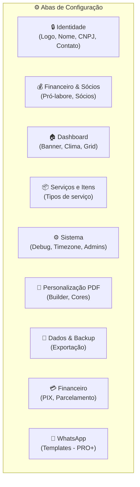

### Aba: Identidade

| Campo | Descrição |
|-------|-----------|
| Nome do Sistema | Aparece no header e PDFs |
| Nome Fantasia | Nome comercial |
| Logo Principal | PNG transparente, máx 2MB |
| CNPJ/CPF | Documento da empresa |
| Telefone | Contato principal |
| E-mail | E-mail da empresa |
| Endereço | Endereço completo |

### Aba: Financeiro & Sócios

- **Dia do pagamento** do pró-labore
- **Percentual de reserva** (caixa da empresa)
- **Configuração de sócios:** usuário, percentual de participação

### Aba: Serviços e Itens

- **Tipos de serviço** personalizáveis (nome, cor, ícone, garantia em dias, descrição PDF)
- Os identificadores (slugs) são fixos para manter a lógica
- Link para a **Tabela de Preços Unificada**

### Aba: Sistema

- **Modo Debug** (toggle)
- **Timezone** (São Paulo por padrão)
- **E-mails de administradores**

### Ações do header

| Botão | Ação |
|-------|------|
| **Baixar Backup** | Exporta dados em ZIP (tabelas selecionáveis + arquivos opcionais) |
| **Resetar Cache** | Limpa views, rotas, config e cache de settings |

---

## 33. Dados e Backup

### Exportação de dados

1. ⚙️ **Configurações** → aba **Dados & Backup**
2. Selecione as **tabelas** para exportar:
   - Usuários, Cadastros, Financeiro, Orçamentos, OS, Estoque, Agenda, Tabela de Preços
3. Opção de **incluir arquivos** (fotos, documentos do Storage)
4. Clique em **Baixar Backup**
5. Download automático do ZIP

> ⚠️ Incluir arquivos pode resultar em ZIP muito grande.

---

## 34. Painel Super Admin

O Painel Super Admin é exclusivo para o **dono do sistema** (você), permitindo gerenciar todos os tenants.

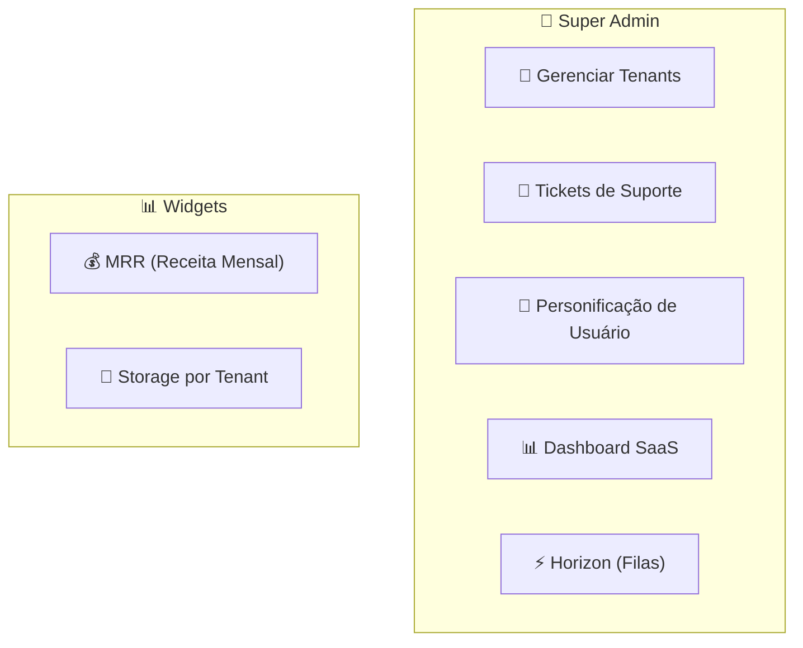

### Gerenciar Tenants

| Campo | Descrição |
|-------|-----------|
| **Nome** | Nome da empresa |
| **Slug** | URL amigável |
| **Plano** | Start, Pro, Elite |
| **Ativo** | On/Off |
| **Máx. Usuários** | Limite de usuários |
| **Máx. Orçamentos/Mês** | Limite mensal |
| **Limite OS/Mês** | 0 = ilimitado |
| **Status Pagamento** | Trial, Ativo, Inadimplente |
| **Trial** | Data de término do trial |
| **Gateway** | IDs de pagamento (Asaas) |

### Personificação (Impersonation)

- Permite ao Super Admin **logar como qualquer usuário** de qualquer tenant
- Ideal para **suporte remoto** sem precisar da senha do cliente
- Totalmente auditado

### Dashboard SaaS

- **Widget MRR:** Receita mensal recorrente de todos os tenants
- **Widget Storage:** Uso de disco por tenant

### Horizon (Filas de Jobs)

- Acesso direto ao **Laravel Horizon** para monitorar filas
- Controle de jobs de PDF, e-mails, PIX, etc.

---

## 35. LGPD e Segurança

O sistema foi construído com conformidade à **Lei Geral de Proteção de Dados (LGPD)**.

### Medidas implementadas

| Medida | Descrição |
|--------|-----------|
| **Criptografia AES-256** | CPF, e-mail, telefone e celular são criptografados no banco |
| **Hash HMAC-SHA256** | Para busca exata de dados sensíveis sem descriptografar |
| **Assinatura Legal Digital** | Registro de IP, hash e timestamp em orçamentos e OS |
| **Audit Trail** | Todas ações (criar, editar, deletar) são registradas |
| **Soft Delete** | Dados não são excluídos permanentemente |
| **Magic Links** | Tokens temporários para acesso do cliente |
| **Rotas Assinadas** | URLs com assinatura criptográfica para compartilhamento |
| **Multi-tenancy** | Isolamento completo de dados por empresa |

---

## 36. Tickets de Suporte

### Para o cliente (Tenant)

1. Menu → **Abrir Ticket de Suporte**
2. Descreva o problema com detalhes
3. Acompanhe o status

### Para o Super Admin

1. Painel Super Admin → **Tickets de Suporte**
2. Visualize todos os tickets de todos os tenants
3. Responda e atualize o status

---

## 37. Glossário

| Termo | Significado |
|-------|-------------|
| **Tenant** | Empresa/cliente que usa o sistema (multi-inquilino) |
| **OS** | Ordem de Serviço |
| **CRM** | Customer Relationship Management (Gestão de clientes) |
| **Funil** | Pipeline de vendas em formato Kanban |
| **Magic Link** | Link de acesso temporário sem senha |
| **PIX** | Sistema de pagamento instantâneo brasileiro |
| **LGPD** | Lei Geral de Proteção de Dados (Lei 13.709/18) |
| **Multi-tenant** | Arquitetura onde um software serve múltiplos clientes isolados |
| **Pró-labore** | Remuneração dos sócios da empresa |
| **Webhook** | Notificação automática de sistema externo |
| **Slug** | Identificador amigável para URLs |
| **Soft Delete** | Exclusão lógica (dados ficam marcados como excluídos, não apagados) |
| **Audit Trail** | Registro histórico de todas as ações no sistema |
| **QR Code PIX** | Código de barras bidimensional para pagamento PIX |
| **Copia e Cola** | Código alfanumérico do PIX para pagamento manual |

---

> 📌 **Documento gerado automaticamente** com base na análise completa do código-fonte do sistema **Autonomia Ilimitada** — Março/2026.
